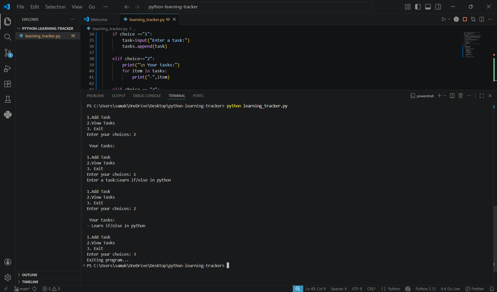

# Python Learning Tracker

##  About the Project
This project is a command-line task tracker built while learning Python from scratch.  
It is designed to evolve step-by-step into a production-level application.

## Learning Progress
- Day 1: Basic task storage using lists
- Day 2: Menu-driven program using loops and conditionals
- Day 3: (Coming next...)

## Tech Used
- Python (core fundamentals)

## Goal
To build strong Python fundamentals and gradually extend this project into:
- File-based persistence
- OOP-based architecture
- Database integration
- API development
- AI/ML features

## How to Run
```bash
python tracker.py

## 📸 Demo

Command-line task tracker in action:


---

## 🗑️ Delete Task Feature (Day 3)

Demonstration of deleting a task using index:


